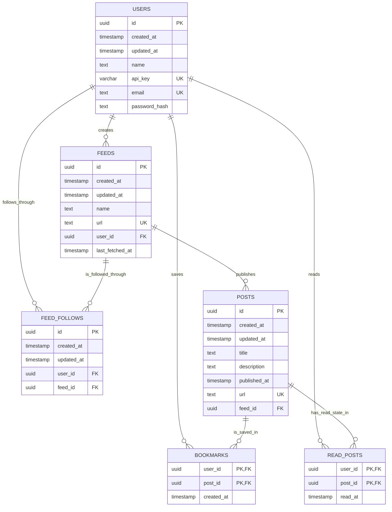

# RSS Aggregator Database ER Diagram

This is the current design through Phase 4. Categories are intentionally not included.

## How to remember the design

- A user creates feeds and follows feeds.
- A feed publishes many posts.
- `feed_follows` connects users to the feeds they follow.
- `bookmarks` connects users to the posts they save.
- `read_posts` connects users to the posts they have read.
